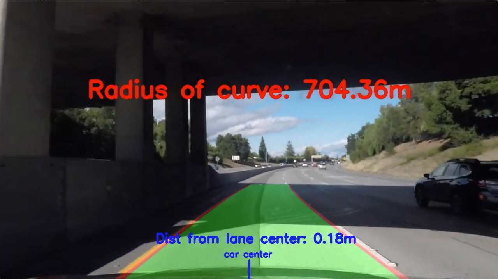

# Finding Lane Lines: Take 2
<figure>
  
</figure>
 

 

In my [Finding_Lane_Lines repository](https://github.com/sathomas2/Finding_Lane_Lines/), I made a first stab at using edges to detect lane lines on a road. Now, I'm going to upgrade my edge-detection and line-drawing techniques to account for natural distortion that occurs when images are captured by lenses and for more diverse conditions, like curvy roads, roads with irrelevant lines from aging, drastic road-color changes, and difficult shadows. 

The contents of this repository include two videos 'project_video.mp4' and 'challenge_video.mp4' taken from the hood of a car driving on highways. 20 images of checkerboards taken by the same camera are in the 'camera_cal' directory. The 'output_videos' directory contains my results. 

Clone the repository and run it yourself on 'project_video.mp4' with: **python advanced_lane_lines.py**

Or run it on 'challenge_video.mp4' with: **python advanced_lane_lines.py challenge**

The rest of the README will walk through the pipeline.

### 1) Calibrate Camera
<figure>
 
</figure>
 

 
When lenses on a camera filter light to capture an image, the light bends before it hits the film or sensor, causing distortions near the edges of the image. For example, see the top-right corner of the orignal chessboard image above. To deal with this, OpenCV has a useful set of tools that detect inner corners of a chessboard. Since chessboards have a uniform appearance in 3D reality, we can figure out where the corners should appear without distortions. Using the transform matrix for the chessboards, every image taken by the camera can be undistorted. This preprocessing step can be done for any image as long as we have the camera and take some pictures of chessboards on a flat surface (about 20 is recommended).

### 2) Detect Lane Edges
<figure>
 
</figure>
 

With only one camera and no other sensors, detecting edges gets frustrating if road color, lane lines, and light conditions constantly change, as they do in the real world. Even humans have these problems. Think about the daily congestion on highways during sunrise or sunset, not because of rush hour, but because of those stretches where glare hits the drivers' eyes. It doesn't seem that any one detection technique works in all conditions. One solution is to create a patchwork of techniques with logic gates. For the problems presented in the two videos I'm working with, I chose a combination of three techniques.

1) I use a sobel filter to generate two binary images, one detecting edges in the x direction and the other in the y direction. Although they almost always detect lane edges, since sobel filters only detect changes in pixel values, they don't detect the white or yellow between the lane-line edges. Also they detect lots of extraneous edges.

2) I convert the image to HLS color values and threshold the saturation channel. This is generally good at detecting the solid yellow lines. Although it often detects extraneous edges, those extraneous edges don't overlap greatly with the sobel filters' edges. Therefore, I only add those edges detected in all three filters, sobel x, sobel y, and hls threshold, to the final binary image.

3) Finally, after experiments trying different threshold values for different channels in HLS, HSV, and RGB versions of the image, I found that thresholding the red and green channels in the RGB image did a pretty good job at picking up lane lines in varying conditions that the sobel and hls filters failed to detect. Also, when the right thresholds are chosen by thinking about which color values represent which features in the images, an RGB filter doesn't seem to pick up extraneous lines. Any line detected by this filter is added to the final binary image.

Below are the four binary images created from the original image above before being combined.
<figure>
 
</figure>
 

 
 ### 3) Bird's-eye View
 <figure>
 
</figure>
 

To mask irrelevant parts of the image and to better represent lane line farther down the road, making it easier to detect the curve of the lane, each image is transformed to look like it was taken from a bird's-eye view. The vertices are found manually using a stretch of straight road in the video.

### 4) Fit Polynomials to Lane Lines
 <figure>
 
</figure>
 

This is the most involved step. I walk through it in detail in the notes in the code. Everything happens within the 'draw_lane_lines' function. Basically, using the coordinates of white pixels detected within the sliding green windows shown above, a second-order polynomial curve is fit with the following equation:
 <figure>
 
</figure>
 

Actually, I use a moving average of the polynomial coefficients calculated over the previous 15 frames to help smooth the curve.

 ### 5) Calculate Radius of Curve and Distance from Lane Center
After fitting the polynomial, a mask is created highlighting the lane in green and lane edges in red. That mask is unwarped from a bird's-eye perspective to the original perspective and then added over the original image. Finally, the radius of the curve is calculated for each line. I take the mean of those to find the current frame's radius of the curve. 

The radius of the curve is defined by the following equation:
<figure>
 
</figure>
 

 
 When simplified, this is:
 <figure>
 
</figure>
 

 
The Udacity Self-Driving Car team linked to this [website](https://www.intmath.com/applications-differentiation/8-radius-curvature.php), which has a great step-by-step walkthrough of the proof, if you're into that sort of thing.
 
I also calculate the car's distance from the lane center. Assuming the camera is mounted on the center of the hood, the middle of the image indicates the middle of the car. I get the distance from the lane center by subtracting the distance from the car's center to one lane line from the distance from the car's center to the other lane line, then dividing by two because an inch gained in one direction is an inch lossed in the other.
 
Here's a screen shot of my results from the curve in the challenge video that caused the most issues:
 <figure>
 
</figure>
 

